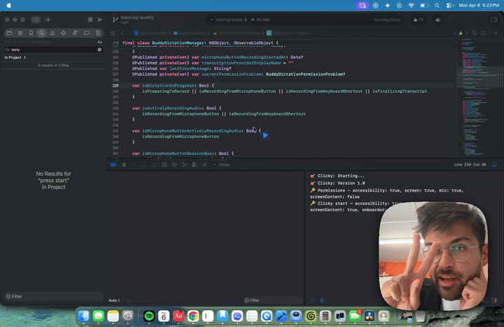

# Clicky

Clicky is a macOS menu-bar companion that can see your screen, talk back, and point at UI elements for you.

It has two main modes:

- Push-to-talk companion: hold `Control + Option`, speak, send your transcript plus screenshot context to OpenAI, then hear the response through system TTS while the blue cursor points at the relevant UI element.
- Guided walkthroughs: record a narrated workflow, turn it into a shareable `clicky://guide?...` walkthrough, and play it back step by step on another machine.



## Stack

- macOS app: SwiftUI + AppKit bridging
- Chat and screen reasoning: OpenAI via a Cloudflare Worker proxy
- Element grounding: MolmoWeb-4B on Modal
- Transcription: AssemblyAI streaming and batch APIs
- Storage: Cloudflare R2 for uploaded guides

The full architecture doc is in `AGENTS.md`.

## Local setup

### 1. Create `.env`

Copy the example file and fill in your values:

```bash
cp .env.example .env
```

The important keys are:

- `CLICKY_WORKER_BASE_URL`
- `CLICKY_MOLMO_BASE_URL`
- `CLICKY_MOLMO_API_KEY`
- `OPENAI_API_KEY`
- `ASSEMBLYAI_API_KEY`
- `ELEVENLABS_API_KEY`
- `ELEVENLABS_VOICE_ID`

The macOS app reads `.env` directly during local development. The worker uses `scripts/sync-worker-dev-vars.sh` to mirror the worker-specific keys into `worker/.dev.vars` before local runs.

### 2. Run the Worker locally

```bash
cd worker
npm install
npm run dev:local
```

That writes `worker/.dev.vars` from the repo-root `.env` and starts Wrangler locally.

### 3. Configure Cloudflare for deploys

For deployed worker secrets:

```bash
cd worker
npx wrangler secret put OPENAI_API_KEY
npx wrangler secret put ASSEMBLYAI_API_KEY
npx wrangler secret put ELEVENLABS_API_KEY
```

`ELEVENLABS_VOICE_ID` still lives in `worker/wrangler.toml` as a plain Worker var.

### 4. Configure Modal for MolmoWeb

```bash
pip install modal
modal setup
modal secret create clicky-molmoweb-api-key VLLM_API_KEY=<your-random-hex>
modal deploy modal/molmoweb.py
```

For local smoke tests against the deployed Modal app:

```bash
python modal/test_ground.py
```

That script reads `CLICKY_MOLMO_BASE_URL` and `CLICKY_MOLMO_API_KEY` from `.env`.

### 5. Run the macOS app

```bash
open leanring-buddy.xcodeproj
```

In Xcode:

1. Select the `leanring-buddy` scheme.
2. Set your signing team.
3. Hit `Cmd + R`.

Do not run `xcodebuild` from the terminal for normal local development. This project intentionally relies on Xcode builds so macOS permissions do not get invalidated.

## Permissions

The app needs:

- Microphone
- Accessibility
- Screen Recording
- Screen Content

## Project structure

```text
leanring-buddy/          Swift app source
worker/                  Cloudflare Worker proxy
modal/                   MolmoWeb deployment and smoke test
scripts/                 Local helper scripts
AGENTS.md                Current architecture and coding instructions
```

## Contributing

If you change architecture, setup, or conventions, update `AGENTS.md` so the repo docs stay aligned with the code.
